# html-presentation

**简体中文** · [English](README.en.md)

> 单文件 HTML 演示文稿模板库 —— 20 套模板 × 每套 10 页完整示例，零依赖，断网可用。

一个面向 AI Skill 与普通用户的 HTML 幻灯片模板仓库：不用装任何工具，浏览器打开即可演示；每套模板都是一场内容完整、排版经过验证的真实演示，改文字就能变成你自己的幻灯片。

---

## ✨ 特性

- **单文件，零依赖** —— 所有 CSS / JS / 图表 / 代码高亮全部内联。不引用任何 CDN、外部字体或图标库，断网双击照常运行。
- **20 套模板 × 10 页** —— 每套模板自带封面、目录、数据、图表、表格、时间线、引用、结尾等 10 种版式的完整示例，参考价值高。
- **液态玻璃家族设计体系** —— 12 套同一设计基因：饱和渐变/光斑背景、通透毛玻璃舞台、楷体大字、渐变标题字；经典八套（01-08）+ 新增四色（09-12），12 种色彩情绪按需选。
- **Keynote 变体（13-18）** —— 苹果发布会式全屏极简版：玻璃光影 × 3D 玻璃方块 + backdrop-filter 毛玻璃 + 棱镜色散 + 循环扫光；浅色奶油/青瓷/冰川 + 深色黑场/蓝调/极光六款任选。
- **画册与卷轴双变体（19-20）** —— 19 美术馆画册：左对齐非对称版式 + 宋体超大标题 + 杂志式四角细节 + 玻璃画框折射；20 东方卷轴：墨绿鎏金 + 中轴对称竖排主导 + 章回汉字 + 玻璃月/屏风 + 朱砂印章，展览画册与东方美学专属。
- **统一翻页引擎** —— 键盘、触摸滑动、按钮、地址栏深链、全屏切换，12 套模板行为完全一致；13-20 额外支持滚轮翻页。
- **内置避雷规则** —— 仓库自带排版规则与避雷清单，AI 调用时按文档生成，可有效避免「AI 味」的紫渐变、emoji 堆砌、内容溢出等常见问题。
- **可当 Skill 使用** —— 标准的 SKILL.md 结构，可直接挂载到支持 Skill 的 AI 助手环境中。

## 🗂 模板总览

### 经典八套 · Glassmorphism Classics（01-08）

原版玻璃基因：饱和渐变/光斑背景 + 通透毛玻璃舞台 + 楷体大字。

| 模板 | 主题示例 | 适用场景 |
|------|---------|---------|
| 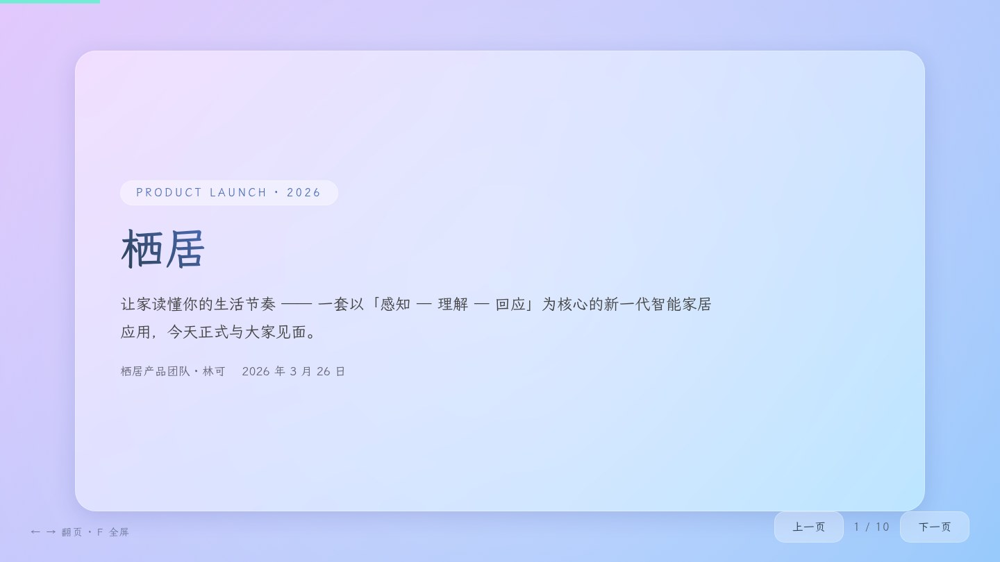 | **01 液态玻璃经典** · 薄荷绿 | 通用产品发布、项目汇报 |
| 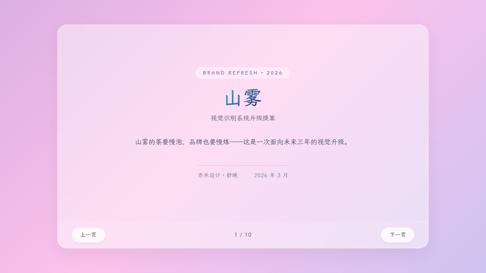 | **02 流光毛玻璃** · 幻紫流光 | 品牌 / 视觉类提案 |
| 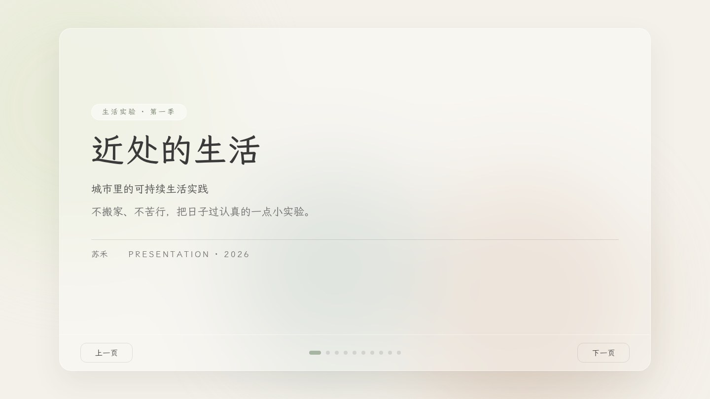 | **03 莫兰迪矿物** · 晨雾绿 | 生活方式、人文分享 |
| 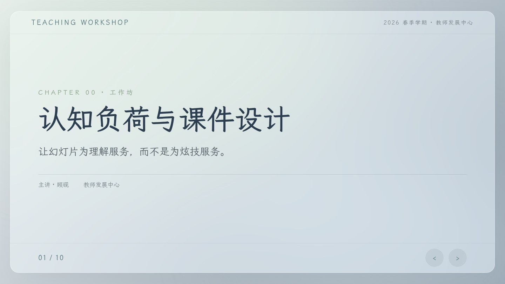 | **04 学术液态** · 灰湖蓝 | 教学课件、教师工作坊 |
| 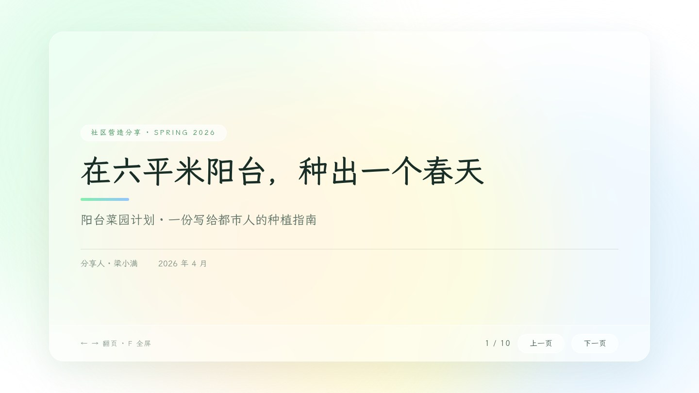 | **05 自然生机** · 新叶绿 | 社区、环保、轻松主题 |
| 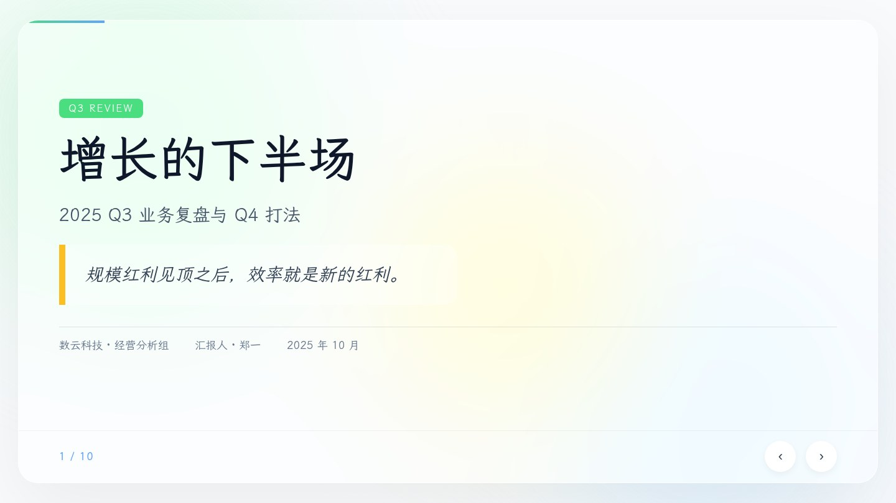 | **06 全要素图表** · 极光绿 | 业务复盘、数据汇报（SVG 图表） |
| 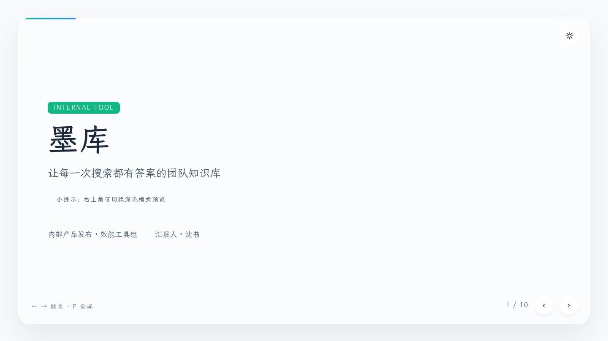 | **07 全能双主题** · 生机绿 | 内部产品发布，明暗一键切换 |
| 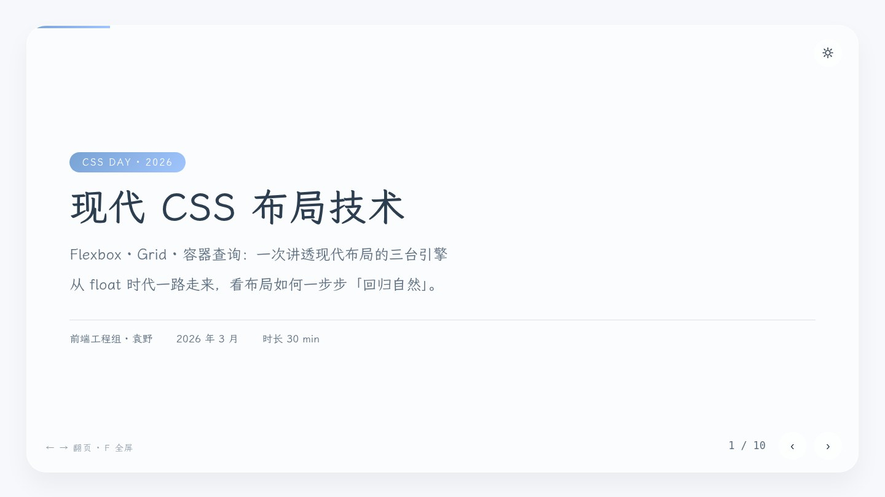 | **08 代码旗舰** · 牛仔蓝 | 技术分享：代码高亮 + 图表 + 双主题 |

### 新增成员 · New Colors（09-12）

与经典八套同一玻璃基因，四个新色彩世界：暖杏陶土 / 薄荷清风 / 樱粉暮蓝 / 落日鎏金。

| 模板 | 主题示例 | 适用场景 |
|------|---------|------|
| 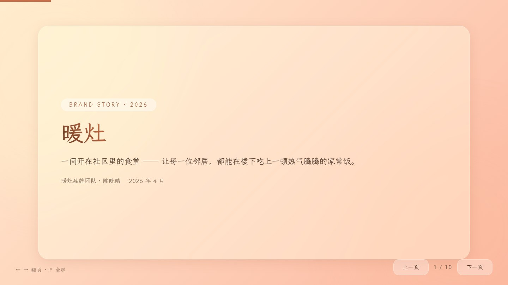 | **09 暖杏陶土玻璃** · 陶土橘 | 品牌故事、餐饮社区（暖调亲和） |
| 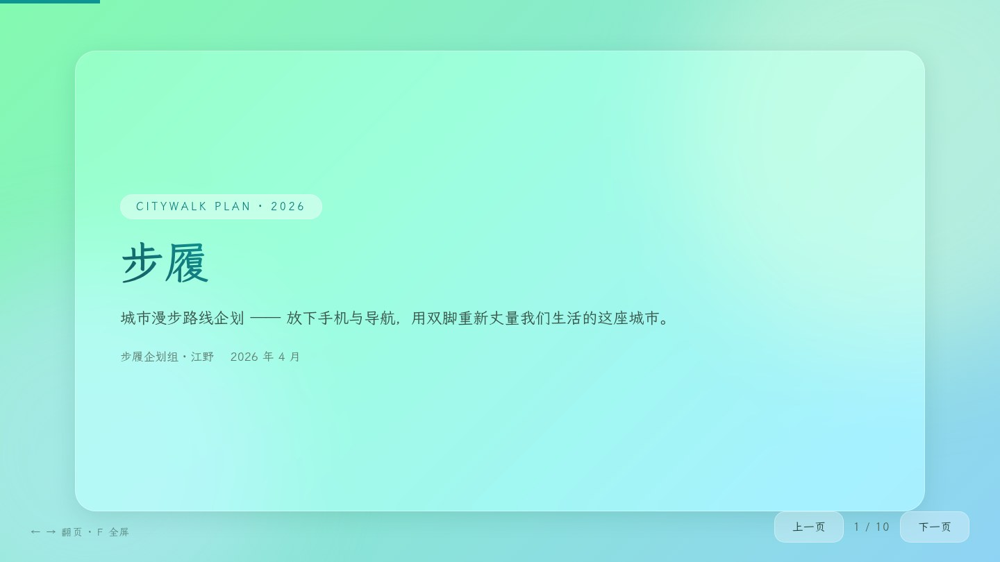 | **10 薄荷清风玻璃** · 深青 | 户外企划、生活方式分享（清新活力） |
| 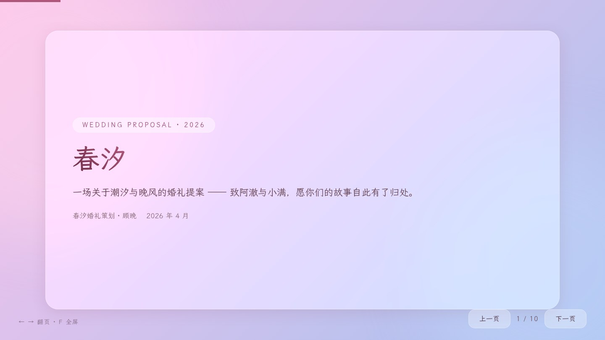 | **11 樱粉暮蓝玻璃** · 玫瑰红 | 婚礼、活动、仪式感提案（浪漫柔美） |
| 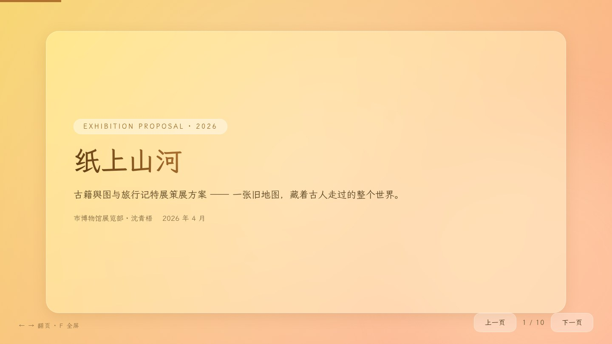 | **12 落日鎏金玻璃** · 琥珀金 | 文化展览、出版人文（温润典雅） |

### Keynote 变体 · Keynote Editions（13-18）

苹果发布会式全屏极简版：每页 100vh、大标题一屏一事、元素错落进场；玻璃方块 + 色散光晕 + 循环扫光全套玻璃光影效果；黑体字系统字体栈，支持滚轮翻页。浅色三款（奶油/青瓷/冰川）+ 深色三款（黑场/蓝调/极光）。

| 模板 | 主题示例 | 适用场景 |
|------|---------|------|
| 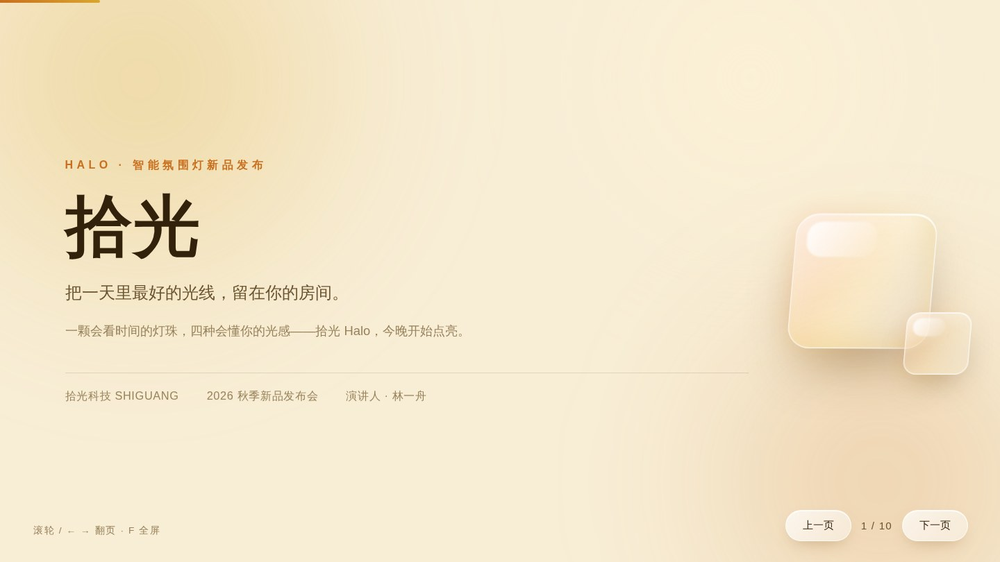 | **13 奶油暖秋玻璃 Keynote** · 焦糖橙 | 产品发布会、新品介绍（奶油米黄底 × 玻璃光影） |
| 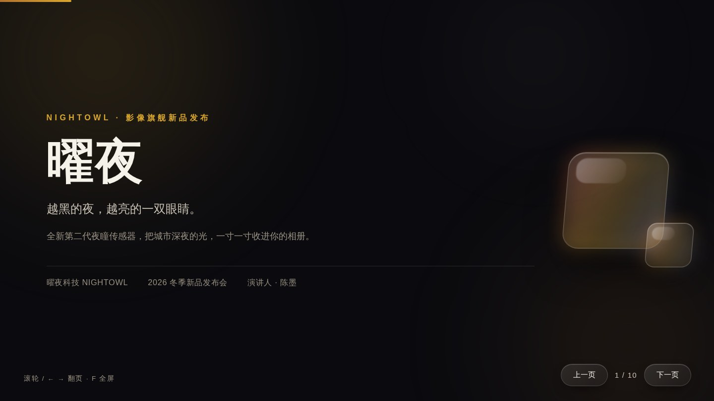 | **14 黑场发布会 Keynote** · 蜂蜜金 | 旗舰发布会、颁奖夜、年度演讲（近黑底 × 深色玻璃） |
| 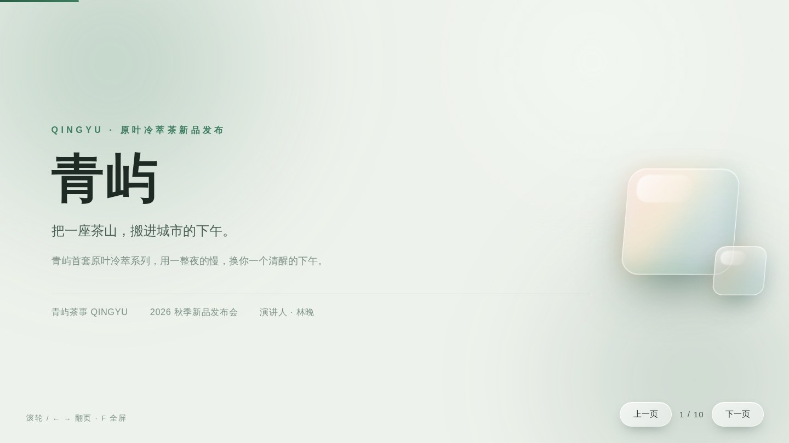 | **15 晨雾青瓷玻璃 Keynote** · 青瓷绿 | 茶饮健康、生活方式品牌发布（晨雾青瓷底 × 白瓷玻璃） |
| 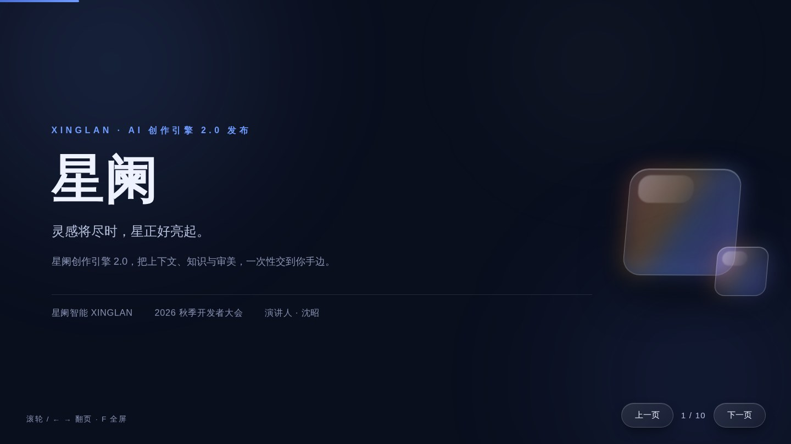 | **16 深空蓝调玻璃 Keynote** · 星芒蓝 | 科技、AI 产品发布（深空蓝黑底 × 星紫色散） |
| 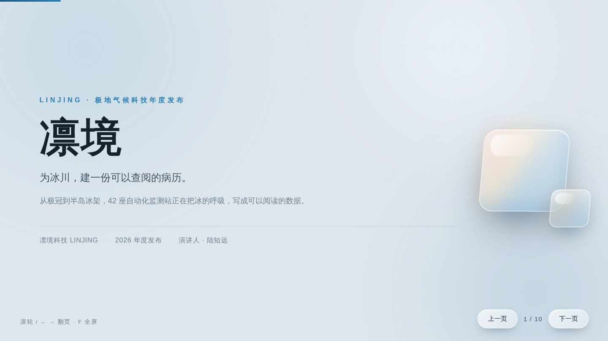 | **17 冰川晨雾玻璃 Keynote** · 冰川蓝 | 环保、气候、硬科技发布（雾蓝灰底 × 白冰玻璃） |
| 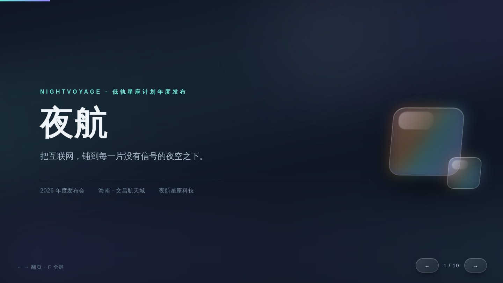 | **18 极光夜航玻璃 Keynote** · 极光青×雾紫 | 航天、通信、夜间主题发布（深夜蓝底 × 斜向极光带） |

### 画册与卷轴变体 · Gallery & Scroll Editions（19-20）

两套高级排版变奏，玻璃只做"器"：19 是西式画册——与发布会居中式相反，左对齐非对称版式、宋体超大标题占左 2/3、正文小字两栏排右下、杂志式四角细节（VOL/日期/章节/页码）；玻璃只做画框——极细描边 + blur12 + 背后大号衬线字折射，一角 ≤10% 极淡色散；纸感噪点无彩色光晕，扫光降至 ≤5%。20 是东方卷轴——墨绿深潭底 × 鎏金 × 月白，中轴对称、楷体竖排主导，章回汉字描边空心大字、五条屏玻璃目录、玻璃月（月晕呼吸）、茶盏、朱砂印章、汉字纪年、远山剪影与萤火；保留 backdrop blur、金系色散与 8s 扫光的玻璃光影。

| 模板 | 主题示例 | 适用场景 |
|------|---------|------|
| 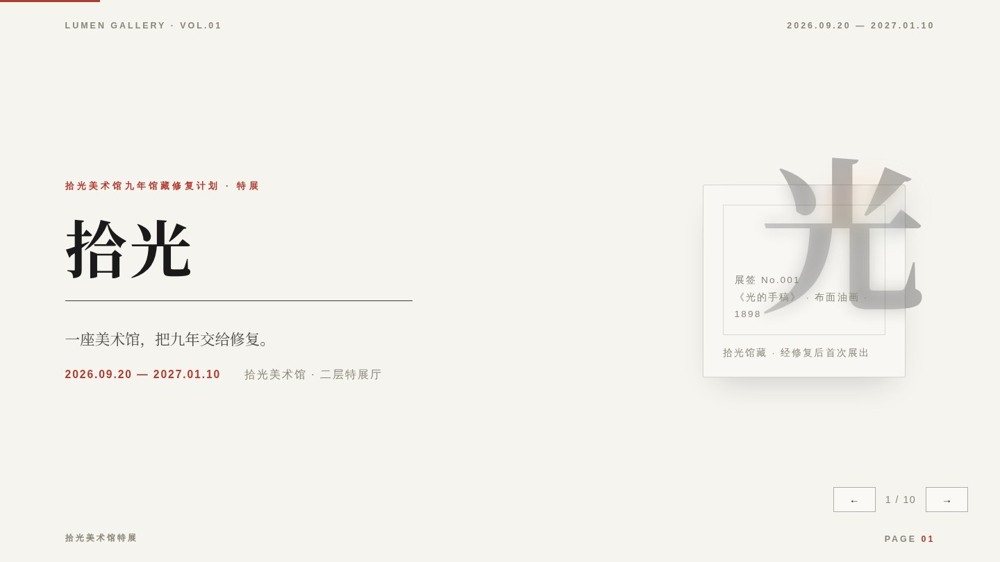 | **19 美术馆画册（暖白纸）** · 朱砂红 | 展览画册、文化特刊、品牌年册（暖白纸底 × 朱砂点缀） |
| 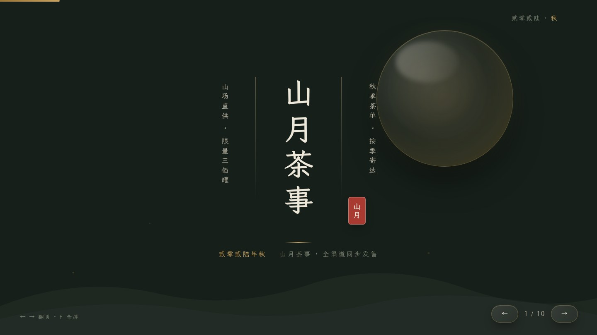 | **20 东方卷轴（墨绿鎏金）** · 鎏金 | 东方美学、茶事雅集、人文刊物（墨绿底 × 竖排章回 × 玻璃月印章） |

## 🚀 快速开始

```bash
git clone https://github.com/your-name/html-presentation.git
cd html-presentation/references/templates
# 双击任意 templateXX.html，浏览器打开即可
```

**改成你自己的内容**：复制一套模板 → 保留全部 CSS 与底部 `<script>` 引擎 → 逐页替换文字与数字 → 保存。完事。

## ⌨️ 操作方式

| 按键 / 手势 | 功能 |
|------------|------|
| `←` `→` `↑` `↓` / `空格` / `PageUp` `PageDown` | 翻页 |
| 鼠标滚轮（13-20） | 翻页（带惯性节流） |
| `Home` / `End` | 第一页 / 最后一页 |
| `F` | 进入 / 退出全屏 |
| `ESC` | 退出全屏 |
| 手机左右滑动 | 翻页 |
| 地址栏加 `#5` | 直达第 5 页 |
| 浏览器前进 / 后退 | 同步翻页 |

## 📁 目录结构

```
html-presentation/
├── README.md                  # 中文文档（本文件）
├── README.en.md               # 英文文档
├── SKILL.md                   # Skill 定义：AI 调用时的工作流
├── LICENSE                    # MIT 开源许可
├── .gitignore
├── assets/
│   ├── previews/              # 模板封面预览图（20 张）
│   └── social-card.jpg        # GitHub 社交分享卡片（1280×640，Settings → Social preview 上传用）
├── scripts/
│   └── qa_overflow.js         # 自检脚本：无头浏览器逐页溢出检测
└── references/
    ├── LAYOUT_RULES.md        # 排版规则：画布、字体、密度预算、组件
    ├── AVOID_LIST.md          # 避雷清单：禁止项 + 自检清单
    ├── TEMPLATES.md           # 模板目录：20 套索引 + 10 页标准结构
    └── templates/
        └── template01-20.html # 20 套模板本体（即文档即示例）
```

## 🎨 设计体系

**10 页标准结构**（20 套模板统一遵循）：封面 → 目录 → 背景问题 → 核心理念 → 关键数据 → 对比分析 → 实施路径 → 深入细节 → 总结展望 → 结尾（13-18 为 Keynote 变奏、19 为画册变奏、20 为卷轴变奏：页型按各自体系重组，页数不变）。

**内容密度红线**：单页要点 ≤5 条、正文 ≤80 字、标题 ≤14 字且主标题必须单行；内容超载一律拆页，禁止缩小字号硬塞——这是「不出现内容截断」的根本保证。

**零依赖三件套**：图表用内联 SVG 手绘、代码高亮用 span 手工着色、图标用内联 SVG 几何形；字体走本地字体栈逐级回退（玻璃系 01-12：LXGW WenKai → 楷体 → 衬线；Keynote 13-18：黑体系统栈；画册 19：宋体衬线栈；卷轴 20：楷体栈）。

**一页一焦点**：每页只传递一个核心信息；UI 强调色全场唯一。

详细规则见 [references/LAYOUT_RULES.md](references/LAYOUT_RULES.md) 与 [references/AVOID_LIST.md](references/AVOID_LIST.md)。

## 🤖 作为 Skill 使用

本仓库根目录的 `SKILL.md` 是标准的 Skill 描述文件。在支持 Skills 的 AI 助手环境中安装本仓库后，助手会在用户提到「做个 PPT / 演示文稿 / slides」时自动触发：选模板 → 复制底稿 → 逐页改写 → 自检交付。规则文件（排版 / 避雷 / 模板目录）会在生成过程中被依次读取，用以约束输出质量。

## 🛠 二次开发

- **改内容**：只动文字与数字，不动 CSS 类结构与引擎。
- **换主题色**：只改 `:root` CSS 变量（双主题模板含暗色变量块）。
- **加页面**：复制结构最接近的一页修改，进度条与页码自动适配。
- **新增模板**：从最接近的家族范例复制，遵循两份规则文档，交付前跑一遍避雷清单第九节的自检项。

## 📄 许可

本项目以 [MIT License](LICENSE) 开源：模板与文档可自由用于个人与商业演示。如果你基于它做了衍生模板，欢迎提 PR 回馈到本仓库。
